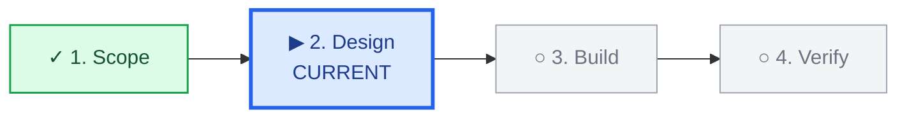

# Adaptive Result Navigation

Help the reader understand the result before asking them to process its details. Adapt the response to the current task instead of forcing every answer into one template.

## Decide whether to apply

1. Honor any explicit request for a format, length, order, table, code block, original text, or step-by-step interaction.
2. Answer simple questions directly. Do not add navigation headings when a short answer is sufficient.
3. Apply navigation when the response contains multiple factors, tradeoffs, steps, evidence, risks, branches, or enough information to create reading or action cost.
4. Identify the reader's primary need: understand, decide, execute, review, or explore. If several needs coexist, organize around the one that most affects the reader's next cognitive or practical action.

## Build the response

Start with the smallest useful first view. It may be one sentence, a short paragraph, or a compact group of points; fixed headings are optional.

- **Understand or analyze:** give the main conclusion first, then the evidence, assumptions, and detail needed to support it.
- **Decide:** give the recommended judgment or the clearest current comparison first, then show only the choices the reader must actually make and their material effects.
- **Execute:** state the immediate objective, current action, and success signal before the necessary steps. When the reader is operating something themselves, prefer progressive instructions over a large batch of steps.
- **Review:** state the real status first, including evidence, exceptions, failures, or unfinished work, then explain the supporting detail.
- **Explore:** state the current understanding, useful directions, and discriminating criteria. Do not invent certainty or force a single conclusion.

After the first view, expand only with information that changes understanding, confidence, choice, safety, or execution. Do not repeat the opening in longer words.

Include actions, decisions, risks, or blockers only when they are real. Never create empty sections, decorative checklists, fake alternatives, or generic next steps to complete a template.

## Show progress for long multi-stage work

Use a progress map only when the work has at least three meaningful stages and the reader benefits from knowing the overall route and current position. Do not add it to short answers, one-shot deliverables, loosely defined exploration, or a process whose stages cannot yet be stated honestly.

Place the map in the first view, immediately after the essential conclusion or status and before detailed explanation.

### Separate work progress from lifecycle status

Before drawing the map, define the scope of the work currently agreed with the reader. The map and its percentage cover only those in-scope stages.

- **Work progress** answers: Which agreed stage is complete, current, pending, or blocked?
- **Lifecycle status** answers: Is the artifact a draft, candidate, approved, merged, released, archived, or otherwise in a product state?
- **Authorization or gate status** answers: Is an external action requested, authorized, ready, blocked, or deliberately excluded from this run?

Do not place an out-of-scope, unrequested, or unauthorized lifecycle action into the work map merely to make the route look complete. State it separately, for example: `Release: out of scope for this run`, `Release: not authorized`, or `Release gate: not ready`. Completing an upload does not imply approval, merge, release, publication, or marketplace listing.

### Mark stage state

1. Name every stage with a short outcome, not a vague activity.
2. Mark completed stages only when completion has evidence.
3. For active work, mark exactly one stage as current. For a completed in-scope workflow, mark every in-scope stage complete and do not invent a current stage. If the current stage cannot proceed, mark that same stage as blocked and state the blocking condition.
4. Leave only later, in-scope work pending. Do not use pending for work that is outside the agreed scope.
5. Prefer a styled horizontal Mermaid stage tracker when the client supports Mermaid. The tracker must make the current position visually unmistakable rather than merely listing stages:



Put a compact work-status label immediately above the diagram, for example: `Work scope: documentation migration | Stage 2 of 4 | Current: Design | Verified progress: 25%`. Use completed-stage progress rather than treating the current stage as completed. Put lifecycle, authorization, or release status on a separate line when it matters.

6. When Mermaid is unavailable or the user asks for plain text, use one compact Markdown stage strip with distinct completed, current, pending, and blocked markers:

```text
✅ Scope  →  🔵 **Design (CURRENT)**  →  ⚪ Build  →  ⚪ Verify
```

Use `✅` only for evidenced completion, `🔵` for exactly one active current stage, `⚪` for later in-scope pending work, and `⛔` for a blocked current stage. Do not rely on color alone; always label the state in text. A deliberately excluded or unauthorized action belongs outside the strip, not as a pending stage.

7. Show `Stage 2 of 4` whenever the stage count and current position are known. Show a percentage only when its basis is defensible:
   - If stages are comparable in effort, calculate progress from completed stages: `completed stages ÷ total stages`.
   - If stages have explicit weights, calculate progress from completed weights.
   - Do not count the current stage as complete merely because it has started.
   - The denominator contains only the agreed in-scope work. Never include a future release, approval, merge, or marketplace action that the reader explicitly excluded.
   - If stage sizes or completion evidence are unclear, omit the percentage rather than inventing precision.
8. Update the map only when a stage completes, the plan changes, or a blocker changes the route. Do not repeat an unchanged diagram in every reply.
9. If the conversation context does not contain reliable prior-stage status, say that progress cannot yet be verified instead of reconstructing false history.

## Preserve truth and control

- Do not hide uncertainty, weak evidence, conflicts, authorization limits, failures, or unfinished work for the sake of brevity.
- Distinguish recommendations, assumptions, candidates, and verified facts.
- Do not describe planned or attempted work as completed. When completion matters, make the supporting evidence visible.
- Do not transfer a decision back to the reader when a clear professional recommendation can be given. Ask for a choice only when the choice genuinely belongs to the reader or missing information materially changes the result.
- If the user asks for a different presentation during the conversation, follow the latest request without treating it as a persistent preference.

## Exit behavior

This skill keeps no memory and changes no external state. Its progress map reflects only the reliable status available in the current context; it is not a persistent tracker. Stop applying it when the response becomes simple, the user supplies another format, or the requested deliverable must remain raw and unaltered.
